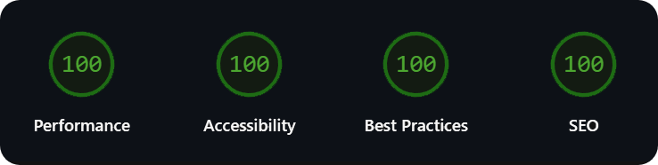

# optimise.js - Automated Site Optimiser🚀

optimise.js helps you build fast, efficient static sites with automated HTML, CSS, and JS optimization and deployment.

## 🚀 How optimise.js Works - ▶️ [Watch Tutorial](https://youtu.be/D3TvT5rhfbQ?feature=shared) 

The `optimise.js` script helps make your website faster and more efficient by automatically optimizing your HTML, CSS, and JavaScript files:

1. 📝 **Reads the Source HTML:** Looks for CSS and JS in `src/index.html`.
2. 🎨 **Extracts and Processes CSS:**
   - 🚮 Removes unused CSS rules
   - 🌐 Adds prefixes (Better Brower compatibility)
   - ✂️ Minifies CSS and saves as `assets/style.min.css`
3. ⚡ **Processes JavaScript:**
   - ✂️ Minifies and bundles JS while removing dead js code.
   - 💾 Saves as `assets/script.min.js`
4. 🏗️ **Updates the HTML:**
   - 🧹 Removes old `<style>` and `<script>` tags
   - 🔗 Inserts references to optimized files
5. 🧼 **Minifies the HTML:**
   - 🗑️ Shrinks HTML and removes comments
   - 💾 Saves as `index.html`
6. 📦 **Final Output:**  
   - Optimized `index.html`, `assets/style.min.css`, and `assets/script.min.js`

> ⚠️ **Note:**  
> For `optimise.js` to work, put all HTML, CSS (in a `<style>` tag), and JS (in a `<script>` tag) inline inside `src/index.html`. 
> (Optional) Attach functions to the `window` object in JS to make them globally accessible and prevent them from being mistakenly removed by tree shaking process.
---

## 🤖 Automated Deployment

All optimization steps are automated with GitHub Actions!  
The workflow in `.github/workflows/deploy.yml` runs every time you update `src/index.html`:

- 🛎 **Triggered on push:** Any change to `src/index.html` starts the workflow
- 🏗️ **Build & Optimize:**  
  - Checks out your code  
  - Sets up Node.js  
  - Installs dependencies  
  - Runs the `optimise.js` script (via `npm run optimise`)
- 🚀 **Auto-commit:**  
  - Commits the optimized files (`index.html`, `assets/style.min.css`, `assets/script.min.js`) automatically
    
🔄 **Dependabot** is enabled!
Whenever a new version of a dependency is released, Dependabot creates a pull request to update it.  
All you have to do is **merge the pull request**—your site always stays updated and secure.

---

## 🗓️ Planned Updates

🖼️ **Image Optimisation** - 
Ability to auto minify images in `assets` folder

---

🛠️ **In simple terms:**  
Click on [Use this Template](https://github.com/new?template_name=Automated-Site-Optimiser&template_owner=TecnikOfficial) button and make necessary changes easily `src/index.html` and get optimised site files in seconds. 
If you run into build errors or want to see what’s happening behind the scenes, you can always check the `build-report.logs` for more information.

✅ **SCAN RESULTS:** [Optimise.js](https://www.virustotal.com/gui/url/11075fbad0d7e9253727b287dc41af51022d900a726745f67a29baf5537be7bc?nocache=1)

---
## 📄 License

This project is licensed under the **Creative Commons Attribution 4.0 International (CC BY 4.0)**.

You are free to use, modify, share, and use this project for commercial purposes, as long as you give appropriate credit.

See the [LICENSE](LICENSE) file for more details.

---

## 🙏 Credits / Dependencies Used

This project is powered by these open-source tools:

- [esbuild](https://www.npmjs.com/package/esbuild) — Ultra-fast bundler and minifier for JavaScript and CSS.
- [purgecss](https://www.npmjs.com/package/purgecss) — Removes unused CSS for optimized production builds.
- [lightningcss](https://www.npmjs.com/package/lightningcss) — An extremely fast CSS parser, transformer, minifier and prefixer.
- [html-minifier-terser](https://www.npmjs.com/package/html-minifier-terser) — Minifies and compresses HTML files.
- [Node.js](https://nodejs.org/) — JavaScript runtime powering the script.
- [GitHub Actions](https://github.com/features/actions) — For workflow automation and deployment.

Special thanks to the open-source community!

---

## 💖 Support the Project

If you appreciate this project and want to support its development, consider making a donation:

